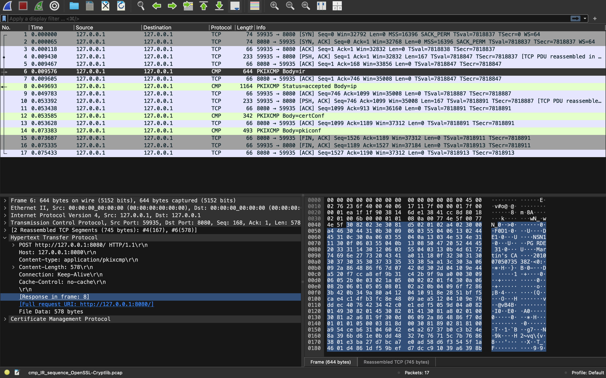

# Network Traffic Analysis: Protocol Triage & Payload Extraction

## 📝 Project Overview
This project demonstrates the core technical workflows of a Security Operations Center (SOC) Analyst using **Wireshark** to investigate network layers, validate protocol handshakes, and reconstruct application-layer objects out of raw packet streams. Through this hands-on lab, I analyzed multi-packet captures (`.pcap`) to differentiate normal system operations from anomalies, investigate unencrypted transactions, and parse network metadata.

## 🛠️ Skills & Tools Demonstrated
* **Tooling:** Wireshark, macOS Terminal
* **Protocols Parsed:** TCP (Three-Way Handshake), HTTP (POST methods), PKIX-CMP
* **Core Competencies:** Traffic triage, application layer data carving, security certificate tracking, and anomaly verification.

---

## 🔬 Investigation Breakdowns

### Phase 1: Live Protocol Handshakes & Session Validation
Using a local packet stream tracking active web transactions over port `8080`, I monitored a complete session exchange from initiation to data transfer.

#### 1. Verifying the TCP Three-Way Handshake
Before data transmission occurred, a standard connection handshake was verified in the sequence:
1. `59935 → 8080 [SYN]` (Client synchronizes)
2. `8080 → 59935 [SYN, ACK]` (Server acknowledges)
3. `59935 → 8080 [ACK]` (Client establishes connection)

**Analyst Insight:** Reconnaissance attacks (like stealth port scans) frequently send rapid `[SYN]` packets across thousands of sequential ports and drop the connection immediately upon response. This session targeted a single, stable destination port and successfully completed the handshake to pass application traffic, ruling out reconnaissance scanning.



---

### Phase 2: Application Layer Data Carving & Certificate Tracking
Once the connection was securely established, the client initiated live `POST` requests. 

```text
Protocol: Hypertext Transfer Protocol (HTTP)
Request Method: POST
Content-Type: application/pkixcmp
Payload Size: 578 bytes
